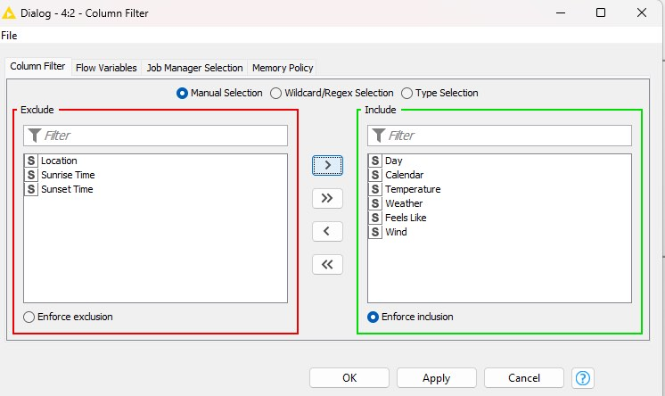
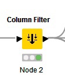

# codelees-AI-ML-2022-project

## introduction

ไฟล์ sheet จะเป็นข้อมูลดาต้าของเรา ที่จะใช้ในการคาดการณ์สภาพอากาศในครั้งนี้ โดยเราจะเลือกโลเคชั่นแค่จังหวัดนราธิวาส ข้อมูลที่ได้มา เราช่วยกันสร้างเอง และเอามาวิเคราะห์ข้อมูลในโปรแกรม KNIME

## Conclusion 

ในการวิเคราะห์ในครั้งนี้เราใช้ Model classification คือ โมเดลการแบ่งกลุ่ม โมเดลที่ได้ผลลัพธ์มากที่สุดของการวิเคราะห์ในครั้งนี้คือ Decision Tree Predictor 42.857% ซึ่งเราได้สกอร์มาไม่ถึงครึ่งเลยด้วยซ้ำ~
( ที่สกอร์ของพวกเรามันออกมาน้อยก็เพราะว่าเราใช้โมเดลการแบ่งกลุ่ม Classification เพราะฉะนั้นตัวแปรแต่ล่ะคอมั่มมันเยอะจนเกินไปจนทำให้การวิเคราะห์ในครั้งนี้ผลลัพธ์ออกมาไม่ดีพอนั้นเอง~_~

## Author 
631431015 Abdulfatah Auma
631431010 Muhammad Dueramae 
 
